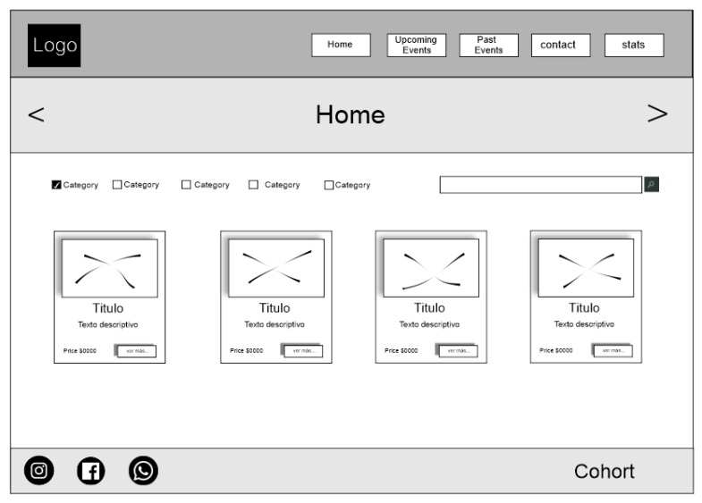
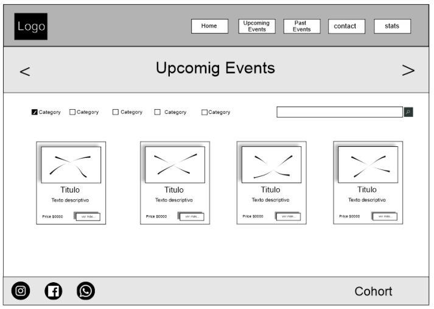
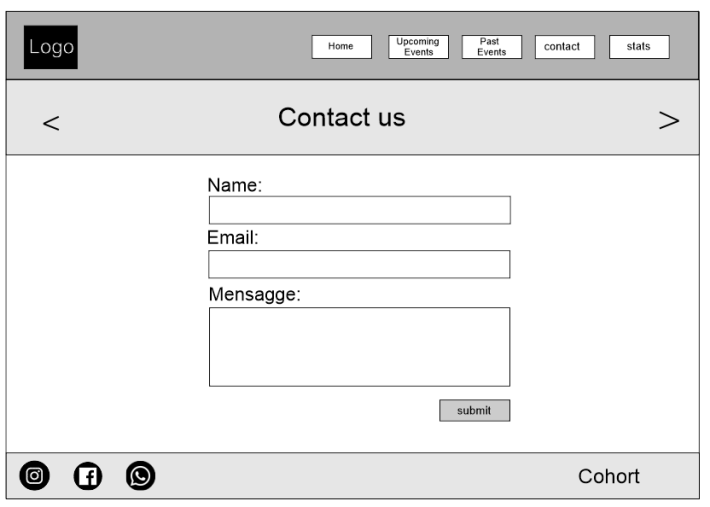
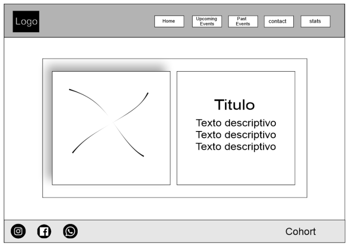
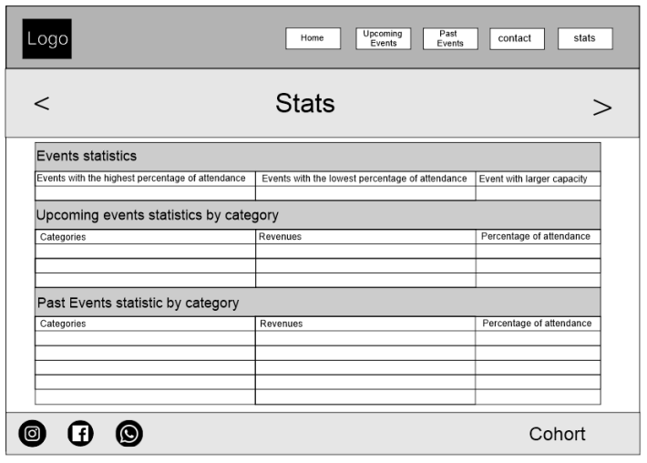

# Introduction to JavaScript Development [FE03-TT] - Amazing Events

## Tabla de contenido
- [Requerimientos del cliente](#requerimientos-del-cliente)
- [Mockup](#mockup)
    - [Home](#home)
    - [Events](#events)
    - [Contact](#contact)
    - [Details](#details)
    - [Stats](#stats)
- [Datos](#datos)
- [Entrega](#entrega)

## Requerimientos del cliente:

> Hola,  
¡Bienvenidos a Web Code! Este es un momento emocionante para que te incorpores, ya que tiene varios proyectos nuevos en cartera como "Amazing Events".  
La idea es desarrollar desde cero la app, pero antes necesitamos que nos envíes algunos ejercicios sobre javascript para ver tus habilidades en ese lenguaje.  
Sé que te quiero en este proyecto, pero todavía estoy trabajando con Amazing Events para aclarar qué les gustaría que hiciéramos para ellos. Me reuniré con ellos esta semana, así que pronto tendremos más detalles Vienes a nosotros recomendado como un experto en HTML/CSS, lo cual es estupendo.  
Mientras trabajo con Amazing Events en los objetivos de su proyecto, me gustaría que repasaras tu JavaScript y te prepararas para sorprendernos a todos.

## Mockup

### Home:


### Events:
- Tenga en cuenta que es una página para Upcoming Events y otra para los Past Events con el mismo diseño


### Contact:


### Details:


### Stats:


## Datos

Cada evento contiene los siguientes datos:
* Nombre.
* Fecha.
* Descripción.
* Categoría.
* Lugar.
* Capacidad.
* Asistencia o presupuesto.
* Precio.

## Entrega
- [X] Debe tener los 6 HTML (Home, Upcoming Events, Past Events, Contact, Details, Stats) previamente presentados en mockups.

- [X] Tu navBar debe estar funcionando y debes poder navegar entre las diferentes páginas. 

- [X] Evita tener errores del Validador.

- [X] Estructura correctamente la carpeta de tu proyecto y define correctamente los nombres de cada uno de los archivos.

    Estructura de carpetas del proyecto:
    ```
    Amazing-Events/
    ├── assets
    │   └── images/
    ├── public/
    │   ├── index.html
    │   ├── contact.html
    │   ├── details.html
    │   ├── past.html
    │   ├── stats.html
    │   └── upcoming.html
    ├── src/
    │   ├── js/
    │   │   └── main.js
    │   └── scss/
    │       └── styles.scss
    ├── .gitignore
    ├── package-lock.json
    ├── package.json
    └── README.md
    ```

- [X] Puedes utilizar tu propio CSS o la librería que prefieras, si lo haces con una librería, asegúrate de que tu proyecto te representa, es decir, que los componentes no son idénticos a los que se encuentran en la librería.

- [x] Incorpora el logo y el favicon en tu página.

- [] El detalle en las fichas que se encuentran en Home o Upcoming Events y Past Events debe ser menor que el que encontramos en Details, esto es debido a que esta última completa toda la información del evento y las anteriores son resúmenes o introducción del evento.

- [X] Utiliza las fotos que te enviamos para hacer las fichas de los eventos.

- [W] Distribuye correctamente los espacios y ten en cuenta que este proyecto será full responsive.
